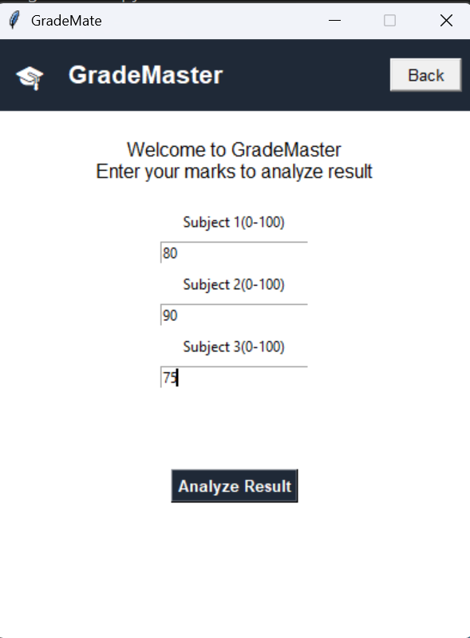
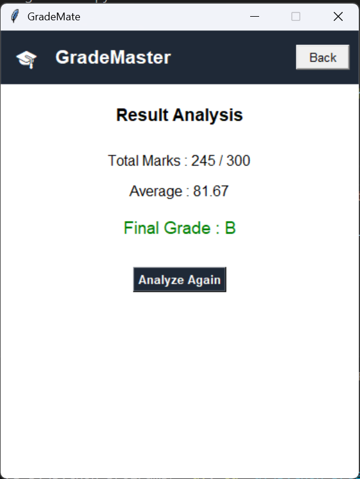

# Week_1_2563051
# 🎓 GradeMaster – Student Result Analyzer (Python GUI)

GradeMaster is a Python-based GUI application built using **Tkinter**.
It allows students to enter marks for three subjects and instantly get
their **total marks, average, and final grade** with a clean and modern interface.

---

## ✨ Features
- Simple & clean GUI
- Input validation (0–100)
- Automatic grade calculation
- Color-based grade feedback
- Easy navigation (Analyze Again / Back)

---

## 🛠 Tech Stack
- Python 3
- Tkinter (GUI)

---

## 📸 Screenshots

### Home Screen


### Result Screen


---

## 🚀 How to Run
1. Install Python 3.x
2. Clone the repository
   ```bash
 git clone 
 https://github.com/H4N1F007
